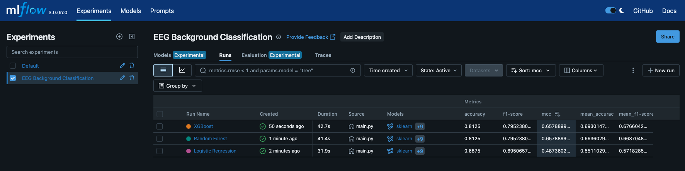

# EEG Background Classification Competition

This repository offers a modular machine learning pipeline for classifying neonatal EEG recordings based on the severity of background abnormalities. It utilizes the publicly available dataset from Zenodo: [Neonatal EEG Graded for Severity of Background Abnormalities](https://zenodo.org/records/7477575).

---

## 🐳 Setup Instructions

### 1. Clone the Repository
```bash
git clone https://github.com/fabiom91/EEG_Background_Classification_Competition.git
cd EEG_Background_Classification_Competition
```


### 2. Build the Docker Environment

Ensure Docker and Docker Compose are installed on your system.


```bash
docker compose build # or docker-compose build
docker compose up -d # or docker-compose up -d
```
> Note: The first build may take some time as it downloads the necessary dependencies, the dataset (>1.6Gb) and sets up the environment.

### 3. Access the Container

```bash
docker exec -it eeg-ml-app /bin/bash
```


### 4. Run the Pipeline

Within the container, execute the main script with desired optios:


```bash
cd app
python main.py [-s] [-a] [-fs]
```


Options:
- `-s`: Include `RobustScaler` for feature scaling.
- `-a`: Apply SMOTE for data augmentatin.
- `-fs`: Perform feature selection to retain top features using `SelectKBest`.

Example:

```bash
python main.py -s -a -fs
```

### 5. View MLflow UI
After running the pipeline, you can access the MLflow UI to monitor your experiments. Open your web browser and navigate to:

```plaintext
http://localhost:5001
```
> Note: The MLflow UI is accessible only when the Docker container is running. If you stop the container, the UI will no longer be available.

Example of MLflow UI:


---

## 📊 Dataset Overview
The dataset comprises 169 one-hour multichannel EEG recordings from 53 full-term neonates diagnosed with hypoxic-ischaemic encephalopathy (HIE) at the Cork University Maternity Hospital, Ireland. Each recording has been graded by two expert reviewers into one of four categories

1.Normal or mildly abnormal
2.Moderately abnormal
3.Severely abnormal
4.Inactive
These grades are based on EEG attributes such as amplitude, frequency, continuity, sleep-wake cycling, symmetry, synchrony, and abnormal waveforms

---

## 🧠 Project Objectives

- Develop an automated pipeline for classifying neonatal EEG recordings into the aforementioned severity grade.
- Ensure modularity, allowing users to customize preprocessing steps such as scaling, data augmentation, and feature selectio.
- Implement robust cross-validation techniques to prevent data leakag.
- Utilize MLflow for experiment tracking and model loggin.

---

## ⚙️ Features

- **Modular Pipeline** Customize preprocessing steps using command-line argument.
- **Cross-Validation** Employs Stratified K-Fold cross-validation to maintain class distribution across fold.
- **Data Augmentation** Optional SMOTE implementation to address class imbalanc.
- **Feature Selection** Optional selection of top features based on statistical test.
- **Hyperparameter Tuning** Bayesian optimization using `BayesSearchCV.
- **Experiment Tracking** Integration with MLflow for tracking experiments and logging model.

---

## 🧪 Methodology

1. **Data Loading**: Load EEG features and corresponding grades from the dataet.
2. **Preprocessing**:
  - Optional scaling using `RobustScaler`.
  - Optional data augmentation using `SMOTE`.
  - Optional feature selection using `SelectKBest`.
3. **Model Training**:
  - Implement Stratified K-Fold cross-validaton.
  - Train models: Logistic Regression, Random Forest, and XGBoost.
  - Perform hyperparameter tuning using Bayesian optimizaton.
4. **Evaluation**:
  - Assess model performance using metrics like MCC, accuracy, precision, recall, and F1-scre.
  - Log metrics and models using MLflow for experiment trackng.

---

## 📁 Repository Structre


```plaintext
├── app/
│   ├── data/                  # Directory for EEG data files
│   ├── main.py                # Entry point for the pipeline
│   ├── models.py              # Model training and evaluation scripts
│   ├── preprocessing.py       # Data preprocessing utilities
│   └── utils.py               # Helper functions
├── docker-compose.yml         # Docker Compose configuration
├── Dockerfile                 # Dockerfile for setting up the environment
├── requirements.txt           # Python dependencies
└── README.md                  # Project documentation
└── Entrypoint.sh              # Download the dataset if not present
```

---

## 📈 MLflow Tracking

MLflow is integrated for tracking experiments. Access the MLflow UI to monitor runs, compare metrics, and manage mdel.
By default, the UI is accessible at `http://localhost:5001`.

---

## ⚠️ Limitations
- The dataset is relatively small, which may affect model performance and generalizability.
- The pipeline is designed for educational purposes and may require further optimization for production use.
- Optional steps (scaling, augmentation, feature selection) may not be necessary for all datasets or models.
- Due to the nature of the data, a better cross validation strategy would be LOSO (Leave One Subject Out) instead of KFold. This is not implemented in this version of the code.
- Data exploration and visualization are not included in this pipeline but are recommended for a comprehensive understanding of the dataset.

## 📜 License

This project is licensed under the [BSD-2 License](LICENSE).

